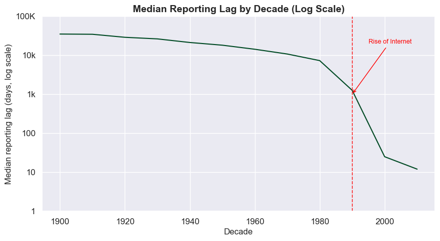
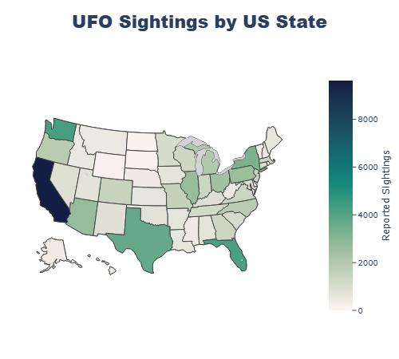
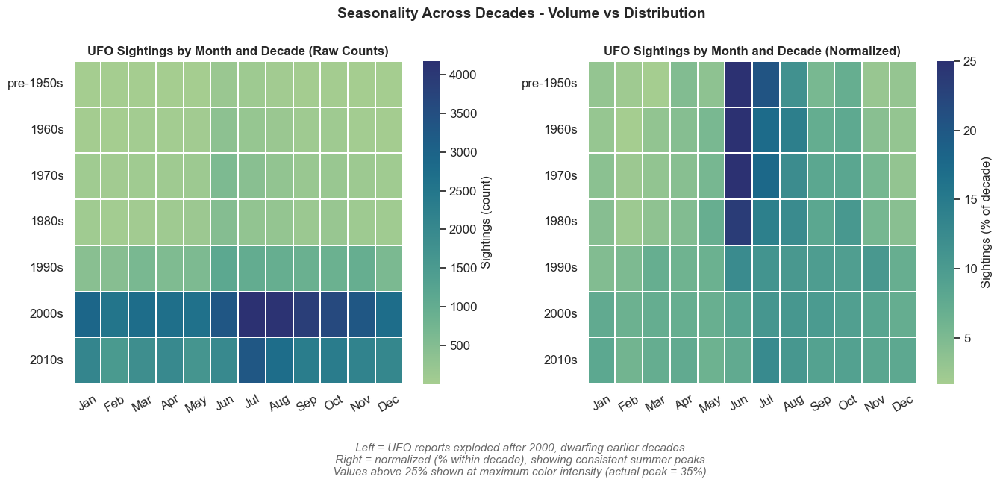
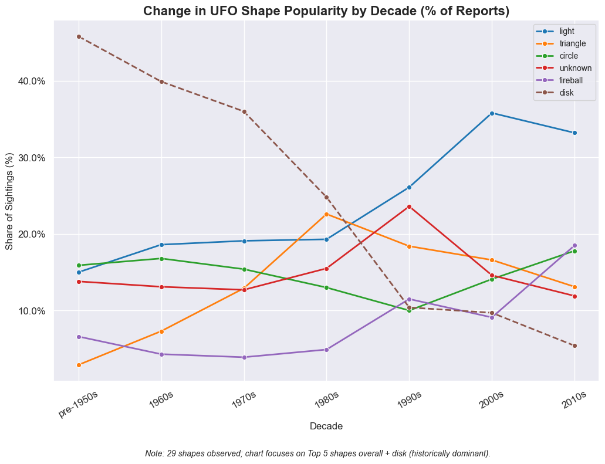

# Exploratory Data Analysis - UFO Sightings


An in-depth exploratory data analysis of **80,000+ UFO sighting records** spanning
1949 to 2014. This project focuses on uncovering hidden patterns in time, geography,
and public perception of UFOs across several decades.

---

## Table of Contents

- [Exploratory Data Analysis - UFO Sightings](#exploratory-data-analysis---ufo-sightings)
  - [Table of Contents](#table-of-contents)
  - [Project Overview](#project-overview)
  - [Dataset](#dataset)
  - [Key Findings](#key-findings)
  - [Visuals](#visuals)
    - [Reporting Lag by Decade](#reporting-lag-by-decade)
    - [UFO Sightings by US State](#ufo-sightings-by-us-state)
    - [Seasonality of UFO Sightings by Decade](#seasonality-of-ufo-sightings-by-decade)
    - [UFO Shape Trends by Decade (% Share)](#ufo-shape-trends-by-decade--share)
  - [Data Cleaning](#data-cleaning)
    - [Missing Values](#missing-values)
    - [Geographic Normalization](#geographic-normalization)
    - [Outlier Handling](#outlier-handling)
  - [Analysis Sections](#analysis-sections)
  - [Skills Demonstrated](#skills-demonstrated)
  - [Project Structure](#project-structure)
  - [How to Run](#how-to-run)
  - [Dependencies](#dependencies)

---

## Project Overview

This project explores over 80,000 UFO sighting records collected between 1949 and 2014 to uncover patterns in how, when, and where people report unidentified flying objects. I chose the UFO sightings dataset because it looked like a fun and interesting topic but turned out to be a genuinely interesting behavioral dataset. Interesting thing about this dataset is that it shows the connection between human behavior and data quality. Although, the sightings themselves are debatable, but the reporting patterns tell a surprisingly clear story. UFO sightings increased nearly 10x between 1995 and 2012 this is not because more UFOs appeared but rather the influence of internet that reduced the obstacles to report and also the influence of popular culture. Using Python, Pandas, Matplotlib, Seaborn and Plotly, I cleaned a heavily messy real-world dataset and applied exploratory analysis techniques to uncover patterns in when people report, where they report from, and how the language they use has shifted over decades.

---

## Dataset

**Source:** [Maven Analytics – UFO Sightings Dataset](https://mavenanalytics.io/data-playground/ufo-sightings)

| Property | Detail |
|---|---|
| Records | 80,332 raw → 80,022 after cleaning |
| Time period | 1906–2014 (analysis focused on 1949–2014) |
| Countries | USA, Canada, Great Britain, Australia, Germany + Rest of World |
| Key columns | datetime, city, state, country, shape, duration, comments |

---

## Key Findings

- **Reporting exploded after 1995** — sightings increased nearly 10x by the early
  2010s, driven by the internet lowering the barrier to file reports.
- **Reporting lag dropped sharply after 1990** — pre-internet witnesses waited
  thousands of days to report; by the 2000s most reports were filed within weeks.
- **Summer dominates** — July, June, and August consistently account for the most
  sightings across every decade, reflecting outdoor leisure behavior.
- **"Disk" gave way to "light"** — the culturally iconic flying saucer shape
  dominated pre-1990s reports but has been overtaken by ambiguous light-based sightings.

---

## Visuals

### Reporting Lag by Decade

> Median reporting lag dropped sharply after 1990, directly tracking the rise of
> the internet. Pre-internet witnesses waited thousands of days to report; by the
> 2000s most reports were filed within weeks.

---

### UFO Sightings by US State

> California, Washington, and Florida dominate US sightings, reflecting both
> population density and coastal geography.

---

### Seasonality of UFO Sightings by Decade

> The normalized heatmap reveals a consistent summer peak across every decade —
> a pattern driven by outdoor leisure behavior rather than the modern reporting boom.

---

### UFO Shape Trends by Decade (% Share)

> "Disk" dominated pre-1990s reports but has steadily declined, overtaken by
> ambiguous light-based sightings - a genuine shift in what people report seeing.

---

## Data Cleaning

The raw dataset contained significant real-world data quality issues. The cleaning
process is documented in `notebooks/1_data_cleaning.ipynb`.

### Missing Values

- `shape` - 1,932 NaN values filled with `"unknown"`
- `comments` - 15 NaN values filled with `"No comment"`
- `state` - ~10,000 missing values resolved via **reverse geocoding**
- `country` - ~9,670 missing values resolved via state-code mapping
  and reverse geocoding

### Geographic Normalization
- Validated and corrected state codes for US, Canada, Great Britain, and Australia
- Fixed legacy Canadian province codes (`nf → nl`, `pq → qc`, `yk → yt`, `sa → sk`)
- Removed invalid US state codes incorrectly assigned to GB and AU rows
- Countries outside the five main ones labeled as `row` (rest of world)

### Outlier Handling
- Removed 93 sightings with durations under 1 second (likely data entry errors)
- Removed 217 sightings lasting over 24 hours (~0.3% of dataset)
- Fixed 3 duration values containing backtick characters
- Fixed 1 invalid latitude entry (`"33q.200088"` → `33.2`)

> ⚠️ **Note:** The cleaning notebook is not designed to be re-run end-to-end.
> Several cells depend on pre-generated geocoding files in `data/interim/`.
> The cleaned dataset already exists at `data/processed/ufo_clean.csv`.

---

## Analysis Sections

| Section | Description |
|---|---|
| Time-Based Trends | Sightings by year, month, day, hour, and decade |
| Geographic Patterns | Country distribution, US state choropleth, Canadian province choropleth |
| Duration Analysis | Distribution of sighting durations, violin plots by decade |
| Shape Analysis | Top shapes, shape trends by decade (counts and % share) |
| Shape × Duration | Heatmap cross-tab of shape vs duration category |
| Seasonality | Month × decade heatmaps (raw and normalized) |
| Reporting Lag | How long after a sighting people report it, and how the internet changed this |
| Text Analysis | Word clouds and top keywords from witness comments by decade |

---

## Skills Demonstrated

**Data Wrangling**
- Missing value handling across multiple strategies
- Reverse geocoding using latitude/longitude
- Outlier detection and evidence-based removal
- Datetime feature engineering

**Geospatial**
- State/province/country code validation and normalization
- Interactive choropleth maps (Plotly) for US states and Canadian provinces
- GeoJSON integration for Canadian province boundaries

**Visualization**
- Seaborn heatmaps, violin plots, bar charts, and line charts
- Plotly interactive maps
- Log-scale histograms for skewed distributions
- Dual-panel normalized vs raw count comparisons

**NLP & Text**
- HTML entity decoding and Unicode normalization
- Stopword removal and tokenization with NLTK
- Word frequency analysis and word clouds by decade

---

## Project Structure

```text
ufo_sightings_eda/
├── data/
│   ├── raw/                # Original dataset from Maven Analytics
│   ├── interim/            # Intermediate files from cleaning process
│   ├── processed/          # Final cleaned dataset (ufo_clean.csv)
│   └── geo/                # GeoJSON boundary files
│       └── canada.geojson
├── notebooks/
│   ├── 1_data_cleaning.ipynb
│   └── 2_exploratory_analysis.ipynb
├── src/                    # Geocoding and preprocessing scripts
│   ├── country_finder.py
│   ├── get_ca_cities.py
│   ├── get_usa_state.py
│   ├── missing_nan.py
│   └── plot_config.py
├── images/
│   └── visuals/            # Exported chart images
├── reports/
│   └── project_summary_report.md
├── requirements.txt
└── README.md
```

---

## How to Run

1. Clone the repository
```bash
git clone https://github.com/alexgantony/ufo_sightings_eda.git
cd ufo-sightings-eda
```

2. Create and activate a virtual environment
```bash
python -m venv venv
venv\Scripts\activate        # Windows
source venv/bin/activate     # Mac/Linux
```

3. Install dependencies
```bash
pip install -r requirements.txt
```

4. Download the dataset from [Maven Analytics](https://mavenanalytics.io/data-playground/ufo-sightings) and place `ufo_sightings_scrubbed.csv` in `data/raw/`

5. The cleaned dataset already exists in `data/processed/`. To run the EDA:

```bash
jupyter notebook notebooks/2_exploratory_analysis.ipynb
```

---

## Dependencies

| Package | Purpose |
|---|---|
| pandas | Data manipulation |
| numpy | Numerical operations |
| matplotlib | Base plotting |
| seaborn | Statistical visualizations |
| plotly | Interactive choropleth maps |
| nltk | Text tokenization and stopwords |
| wordcloud | Word cloud generation |
| pathlib | Path management |

---

*Dataset sourced from [Maven Analytics](https://mavenanalytics.io/data-playground/ufo-sightings).*